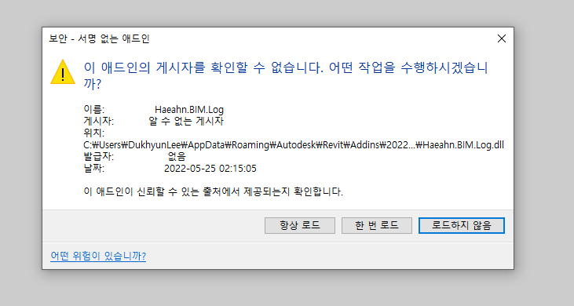
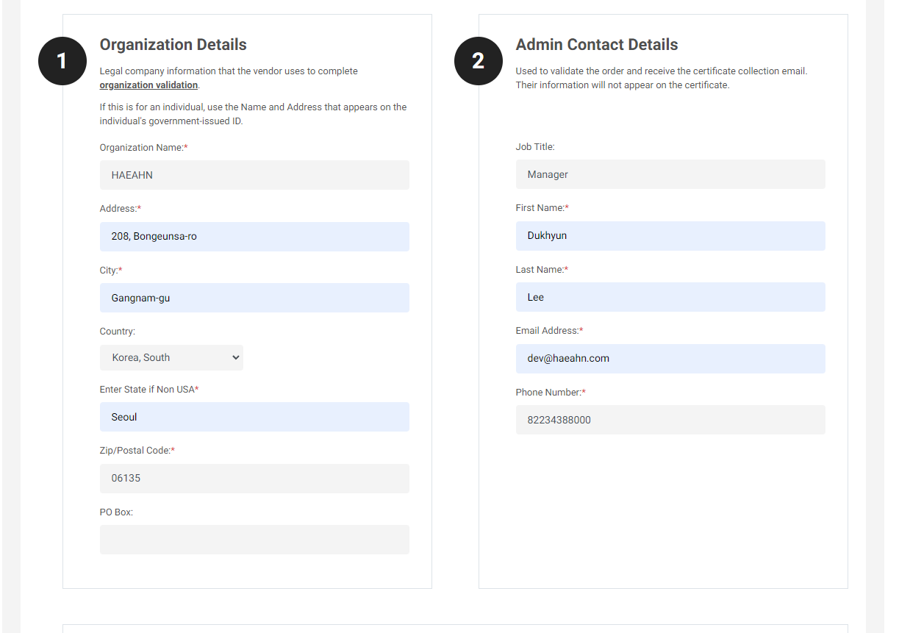
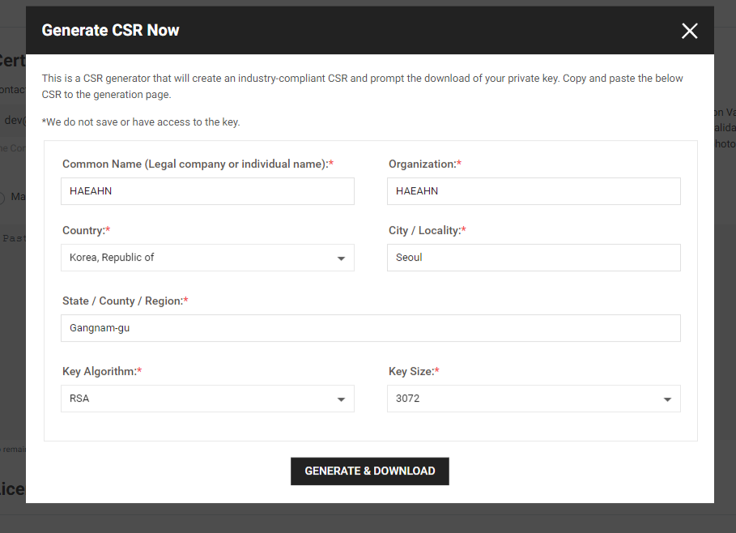

## 이제는 테스트용 애드인 개발은 그만하고 서명(Digital Sign)을 해야하지 않을까

[Revit API Developers Guide](https://help.autodesk.com/view/RVT/2023/ENU/?guid=Revit_API_Revit_API_Developers_Guide_html)

[Digitally Signing Your Revit Add-in](https://help.autodesk.com/view/RVT/2023/ENU/?guid%3DRevit_API_Revit_API_Developers_Guide_Introduction_Add_In_Integration_Digitally_Signing_Your_Revit_Add_in_html)

정식 인증서를 발급하여 배포를 겸할 수 있는 서명 방식이 있고 사내에서 테스트 및 사용 목적으로 서명하는 방식이 있다. 테스트/사용 목적의 서명이라는 것을 테스트해야 하지만 운영단계에 사용할만한지는 확인이 필요하다.

테스트인증서 발급/ 서명후 테스트앱을 설치해보고 운영을 위한 인증서를 확보하여 재 적용해보자.

웹 사이트 용도의 SSL인증서와 어떠한 차이가 있는지, 그 인증서를 Revit앱에 사용할 수 있는지 궁금하다. 이러한 서명 작업은 그 절차가 복잡하고 이해가 안되지만 한 번 알아두면 유용한 것이라 상당한 지식적 가치가 있다.

[](https://docs.microsoft.com/ko-kr/windows/msix/package/create-certificate-package-signing)

[](https://www.ksoftware.net/)

[](https://archi-lab.net/code-signing-of-your-revit-plug-ins/)

```console
> New-SelfSignedCertificate -Type Custom -Subject "CN=Contoso Software, O=Contoso Corporation, C=US" -KeyUsage DigitalSignature -FriendlyName "Your" -CertStoreLocation "Cert:\CurrentUser\My" -TextExtension @("2.5.29.37={text}1.3.6.1.5.5.7.3.3", "2.5.29.19={text}")
```

```console
> $password = ConvertTo-SecureString -String "dukhyun06!!" -Force -AsPlainText
>> Export-PfxCertificate -cert "Cert:\CurrentUser\My\56CB1E85B068C5174D8B5850AA2D6929E3BDA991" -FilePath d:\b.pfx -Password $password
```

> Set-Location Cert:\CurrentUser\My

> Get-ChildItem | Format-Table Subject, Thumbprint





[https://certpanel.com/](https://certpanel.com/comodo/client/orders.aspx)

id: dev@haeahn.com
pw: bimSource20@@

![](images/2022-05-26-11-32-18.png



