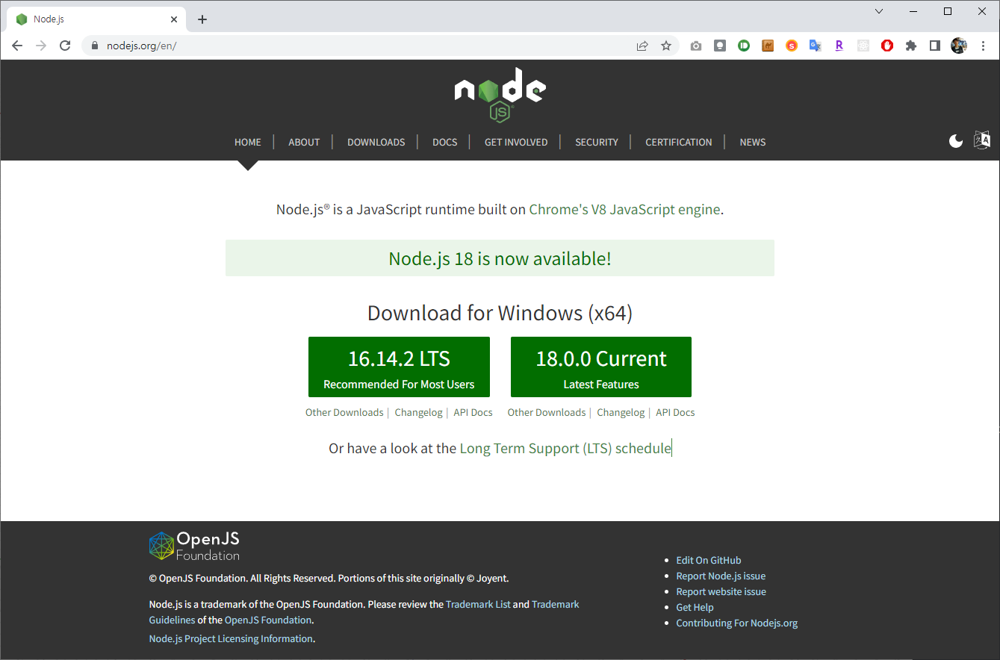
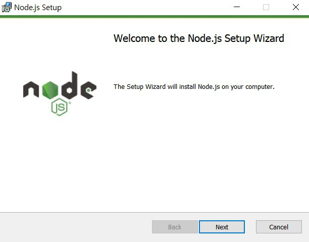
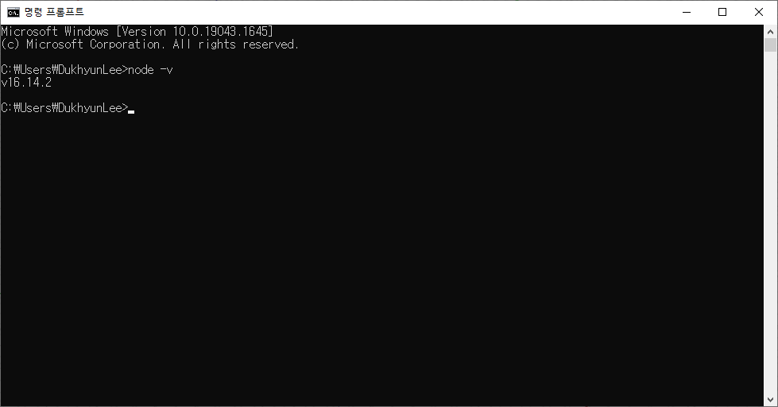
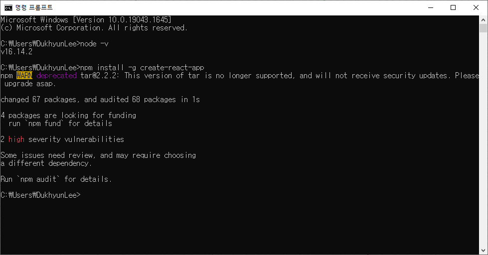
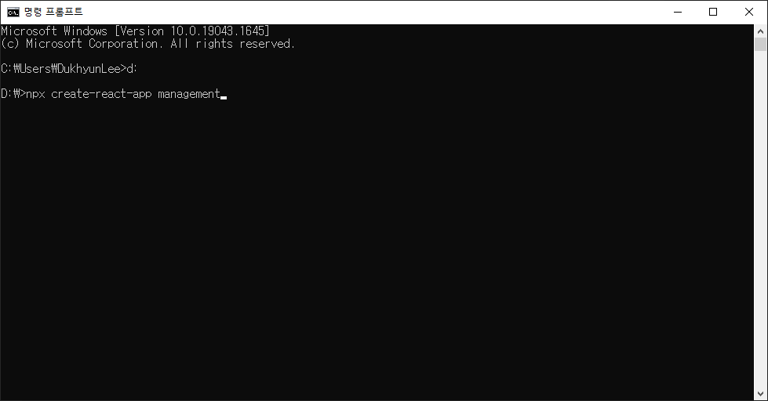
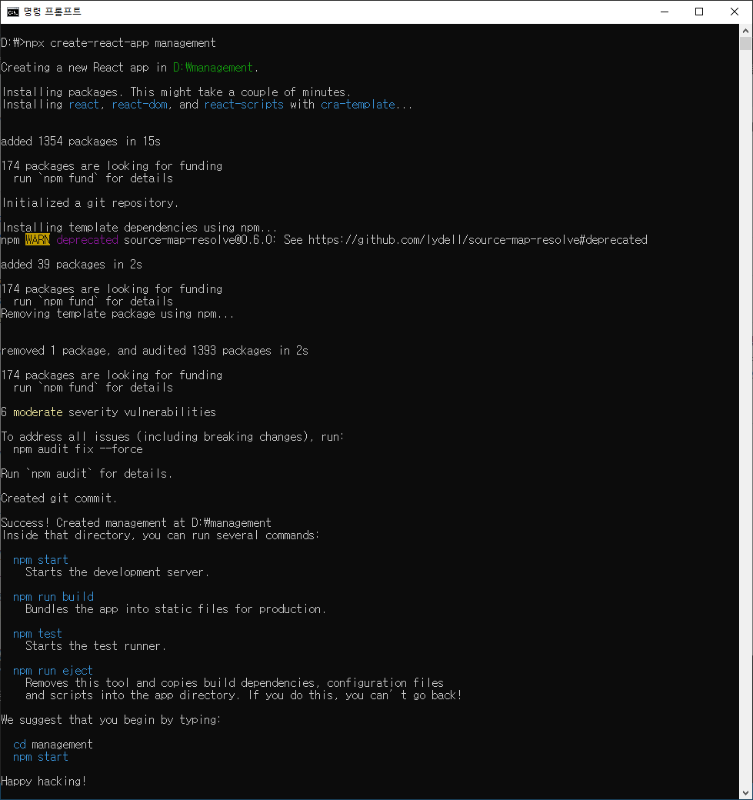
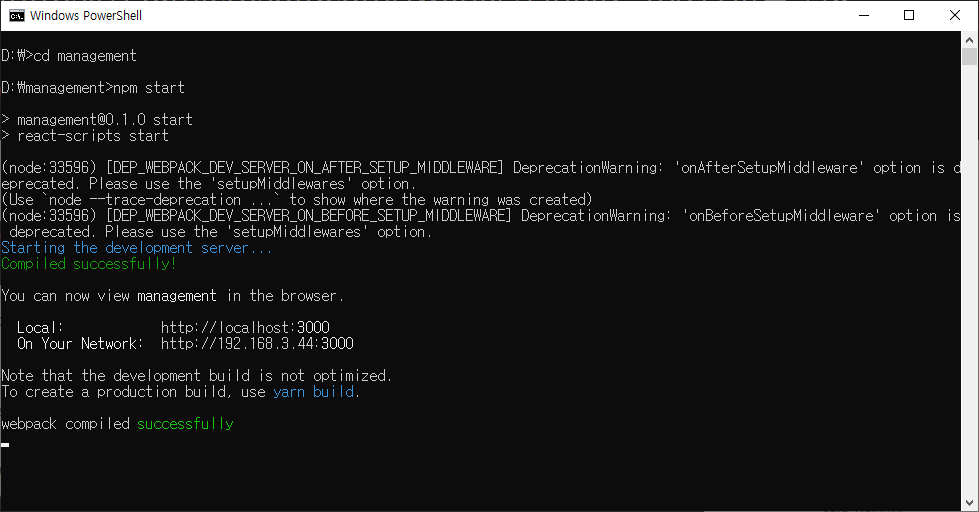
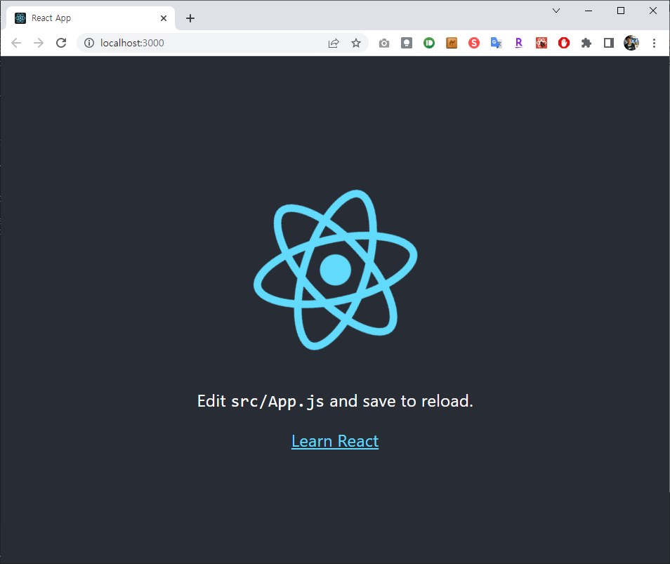

TypeScript Template 기반의 React와 Node.js로 만드는 고객 관리 시스템 개발 강좌의 첫 번째 시간입니다. 이번 시간에는 Create React App을 이용해 리액트 프로젝트를 시작하는 방법에 대해서 소개하고자 합니다. CRA(Create React App)을 이용하면 별다른 환경 설정을 수행하지 않아도 매우 빠르고 간단하게 리액트 프로젝트를 생성할 수 있습니다. 이번 시간에는 빠르게 Create React App을 이용해 프로젝트를 구축해보도록 하겠습니다.

기본적으로 리액트(React) 개발환경을 위해서는 node.js가 설치되어 있어야 합니다.

▶node.js 사이트: <https://nodejs.org/>

안정적인 지원이 가능한 LTS(Long Term Support) 버전인 '16.14.2'를 다운받습니다.



기본적인 설정으로 설치를 진행하시면 됩니다.



설치 이후에는 명령 프롬프트 창에서 node -v 명령어로 설치된 노드의 버전을 확인할 수 있습니다.



node.js를 설치하면 패키지 매니저 도구 NPM이 자동으로 설치됩니다. 이를 이용해서 create-react-app를 설치하시면 됩니다.

```console
> npm install -g create-react-app
```



이제 특정한 폴더로 이동해서 TypeScript Template기반의 React 프로젝트를 생성해주겠습니다. 명령어는 create-react-app {프로젝트 이름}입니다.

우리는 'D드라이브' 로 이동하여 'management' 폴더에 react 프로젝트를 생성하겠습니다.



```console
> d:
> npx create-react-app management_ts --template typescript
```



리액트 앱을 만든 이후에는 해당 프로젝트 폴더로 이동하여 yarn start 명령어로 실행할 수 있습니다. 실행 이후에는 다음과 같이 개발 서버가 구동 중인 것을 확인할 수 있습니다.

```console
> cd management_ts
> npm start
```



인터넷 브라우저가 자동으로 실행되고 http://localhost:3000 으로 접속되고 리액트 앱의 내용이 출력됩니다. 만약 브라우저가 켜지지 않는다면 수동으로 접속 합니다.



참고로 http://localhost:3000, http://127.0.0.1:3000, http://192.168.3.XX:3000 세 방식 모두 동일한 결과가 출력되는데,

:3000 은 react 의 호스팅 포트를 의미하고,

http://localhost, http://127.0.0.1 은 PC 자신의 주소를 의미합니다. [위키: Localhost](https://ko.wikipedia.org/wiki/Localhost)

http://192.168.3.XX 는 PC의 네트워크카드에 의한 주소(IP)이고 192.168.3.1 주소를 가지는 게이트웨이라 불리는 PC들의 연결 지점을 통해 다시 자신의 PC로 접속됩니다.

출처: https://ndb796.tistory.com/211?category=1030599 [안경잡이개발자]
