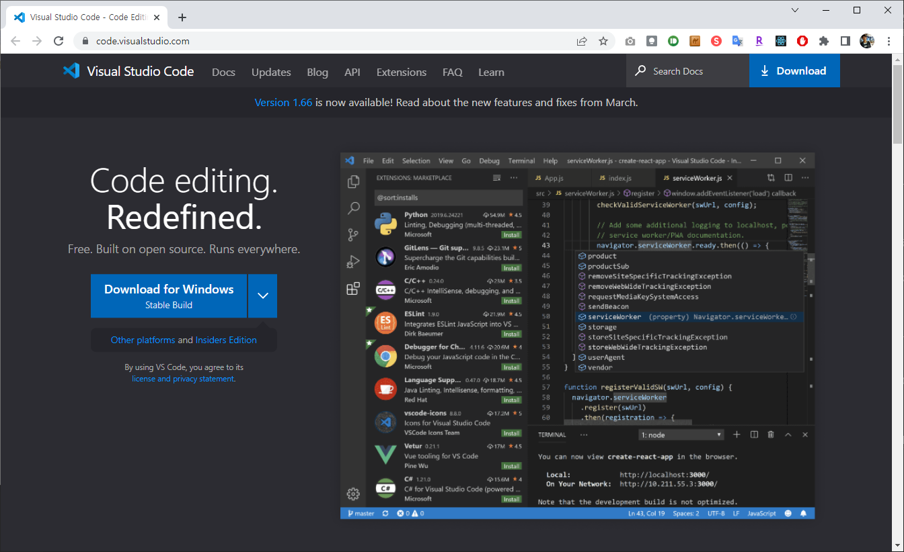
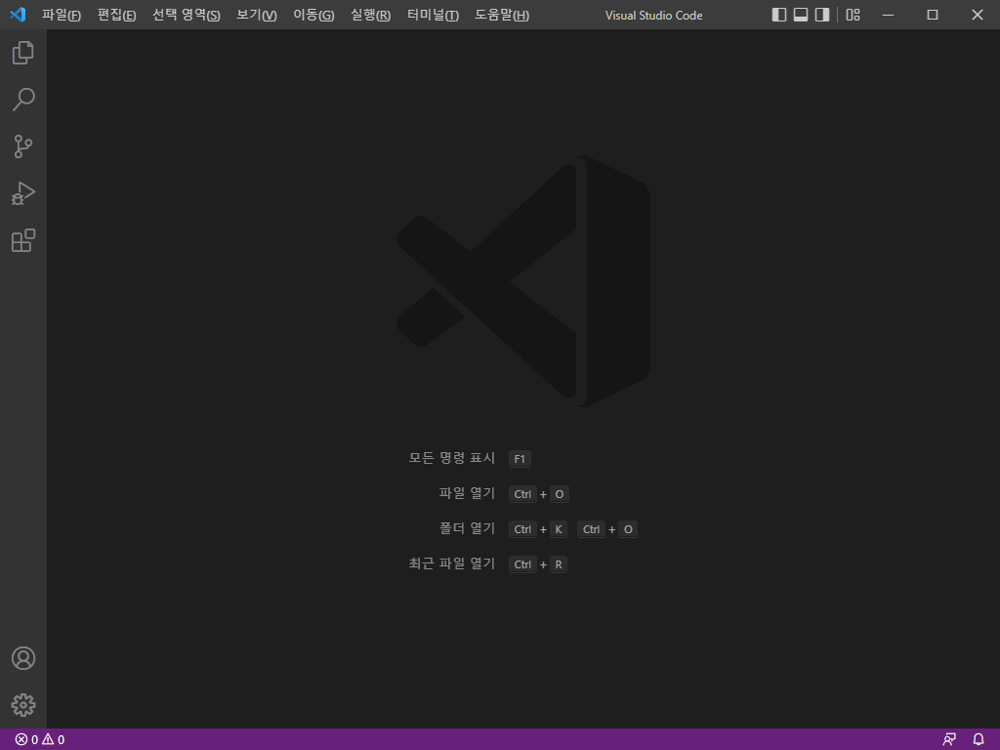
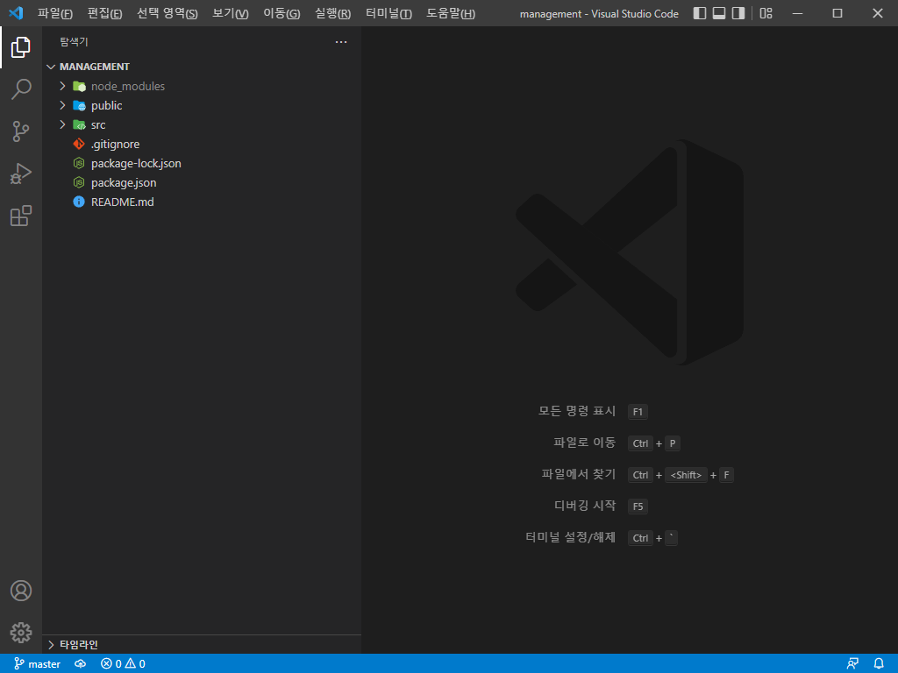
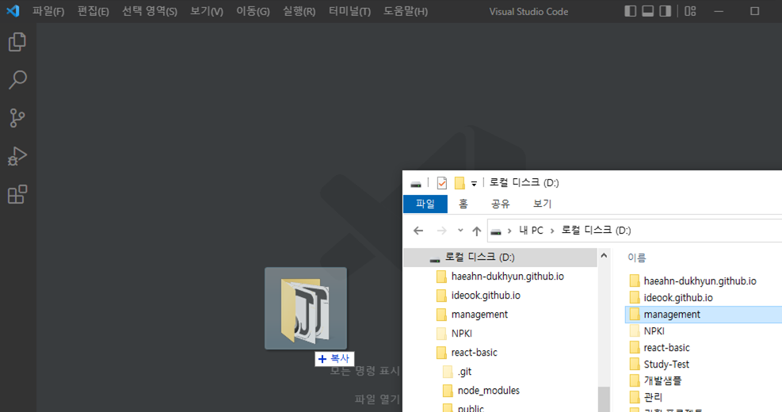
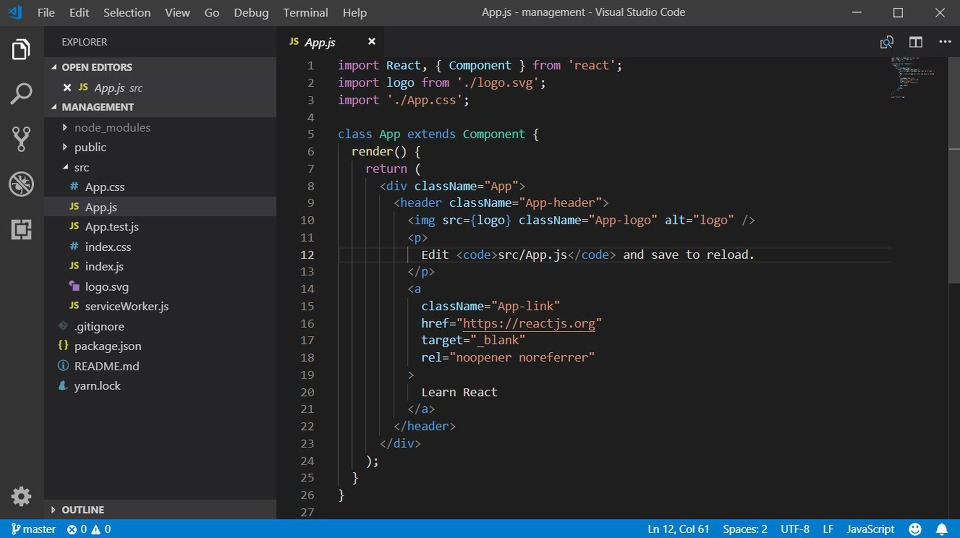
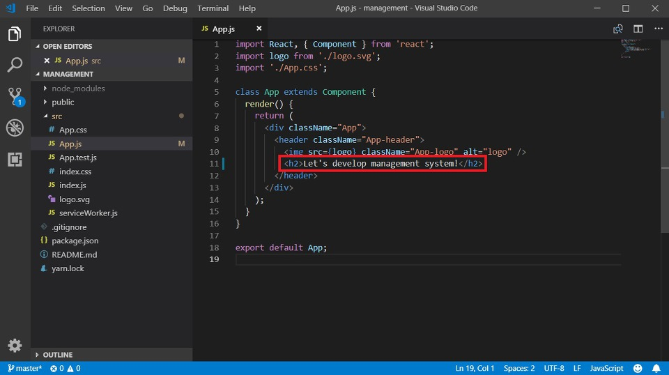
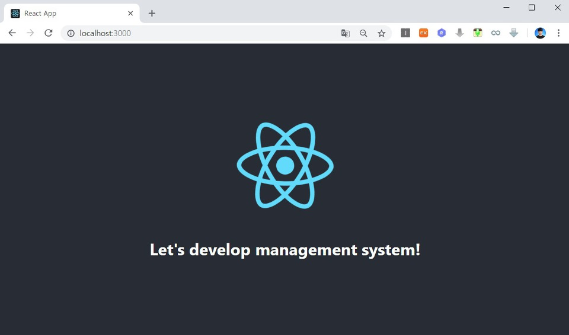

리액트(React) 개발에 있어서 가장 효과적인 통합 개발 환경(IDE) 중 하나는 바로 비주얼 스튜디오 코드(Visual Studio Code)입니다. 일단 지난 시간에 만들었던 리액트 프로젝트를 실행(Start) 시켜주세요. 기본적으로 서버가 구동 중인 상태에서 소스코드를 수정하면 알아서, 수정된 내역에 맞게 다시 컴파일이 이루어지면서 실제 웹 서비스에 반영된다는 특징이 있습니다.

이제 이 상태에서 비주얼 스튜디오 코드를 설치해서 프로젝트 소스코드를 비주얼 스튜디오로 열어 보도록 하겠습니다. 혹시 비주얼 스튜디오 코드가 설치되어 있지 않으신 분은 다음의 사이트에서 설치를 진행하시면 됩니다.

▶ 비주얼 스튜디오 코드(Visual Studio Code) 사이트: https://code.visualstudio.com/

접속 이후에는 자신의 운영체제에 맞는 응용 프로그램으로 설치를 진행할 수 있습니다. 설치를 하실 때에는 기본 설정으로 설치를 진행해주셔도 별다른 어려움 없이 따라오실 수 있습니다.

설치 이후에는 비주얼 스튜디오 코드를 실행해주세요.

이후에 [File] - [Open Folder] 자신의 리액트 프로젝트를 열어주세요.

폴더를 드레그앤 드롭 해도 동일하게 열립니다.

기본적으로 리액트(React)는 App.js라는 이름으로 메인 자바스크립트를 관리할 수 있습니다. 실제로 HTML 문서에서 <body> 태그에 해당하는 내용은 이 App.js가 채우게 됩니다. 따라서 한 번 이 App.js를 수정해 봅시다.

저는 다음과 같이 내용을 대략 아무렇게나 바꾸어 보도록 하겠습니다.

이후에 저장(Ctrl + S)을 해주시면 자동으로 소스코드가 컴파일 되어 다음과 같이 웹 사이트에서 수정 내역을 확인할 수 있습니다.

출처: https://ndb796.tistory.com/212?category=1030599 [안경잡이개발자]
