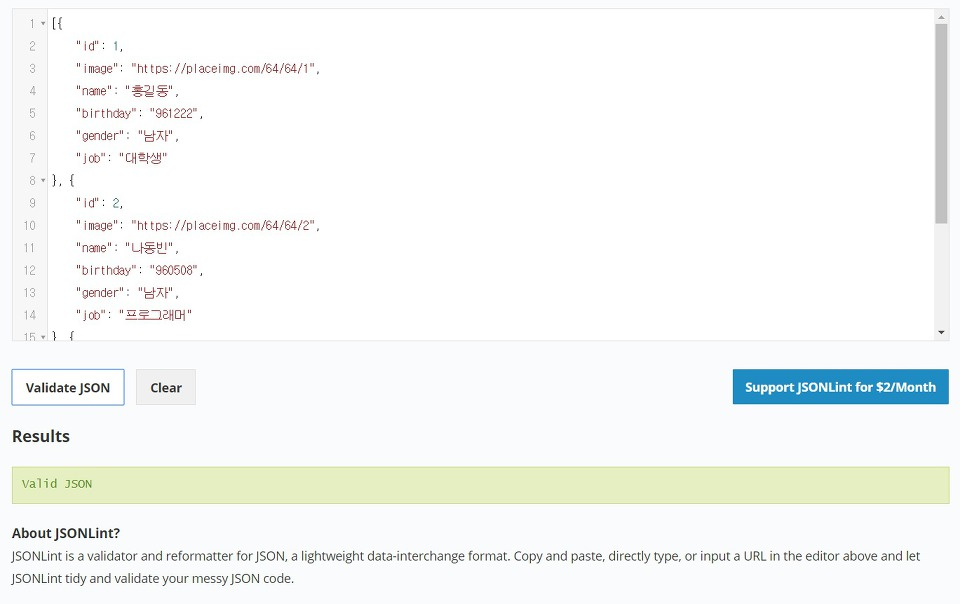
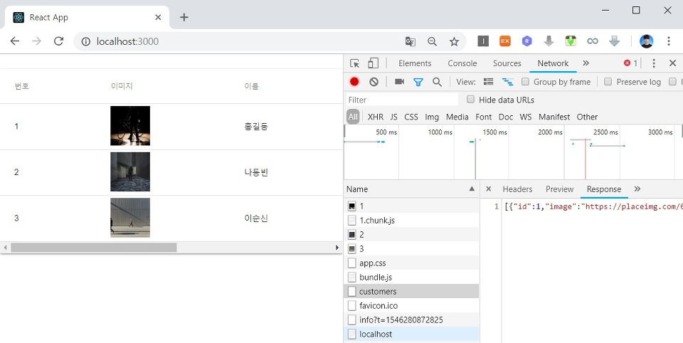

이번 시간에는 지난 시간에 설치한 Node.js Express를 활용하여 REST API를 구축하는 방법에 대해서 알아보도록 하겠습니다. REST API는 최근 상당수의 웹 서버 프레임워크에서 기본적으로 지원하는 기능으로 서버와 클라이언트가 웹 프로토콜을 기반으로 하여 효과적으로 데이터를 주고 받을 수 있도록 해줍니다. 이를 실습하기 위해 가장 먼저 기존의 서버 모듈에 전체 고객 목록을 불러오는 API를 구현해보도록 합시다.

▶ server.js

실제로는 데이터베이스에 있는 고객 정보를 불러오는 형태로 개발이 되어야 합니다. 하지만 일단 다음과 같이 하드코딩을 해봅시다.

```js
const express = require('express');
const bodyParser = require('body-parser');
const app = express();
const port = process.env.PORT || 5000;
app.use(bodyParser.json());
app.use(bodyParser.urlencoded({ extended: true }));

app.get('/api/customers', (req, res) => {
    res.send([
        {
            'id': 1,
            'image': 'https://placeimg.com/64/64/1',
            'name': '홍길동',
            'birthday': '961222',
            'gender': '남자',
            'job': '대학생'
        },
        {
            'id': 2,
            'image': 'https://placeimg.com/64/64/2',
            'name': '나동빈',
            'birthday': '960508',
            'gender': '남자',
            'job': '프로그래머'
        },
        {
            'id': 3,
            'image': 'https://placeimg.com/64/64/3',
            'name': '이순신',
            'birthday': '961127',
            'gender': '남자',
            'job': '디자이너'
        }
    ]);
});

app.listen(port, () => console.log(`Listening on port ${port}`));
```

우리가 만든 /api/customers 경로에 들어가 보면 다음과 같이 고객 목록이 출력됩니다.


고객 목록 데이터가 정상인지 확인하기 위하여 JSON 검증 서비스를 이용해보도록 합시다.

▶ JSON 검증 서비스: <https://jsonlint.com/>

그대로 결과 JSON 문서를 붙여넣기 해보면 다음과 같이 정상적인 데이터라는 것을 확인할 수 있습니다.



이후에 클라이언트(Client)에서 해당 API에 접근하여 고객 목록을 비동기적으로 가져오도록 만들면 됩니다. 가장 먼저 5000번 포트를 API 서버로 이용하기 위해서 클라이언트(Client)의 package.json 최상단에 proxy 내용을 추가합니다.

```json
{
  "proxy": "http://localhost:5000/",
  "name": "management",
  "version": "0.1.0",
  ...
}
```


이제 App.tsx 파일을 작성하여 실제로 API 서버에 접근할 수 있도록 처리하시면 됩니다.

▶ App.tsx

참고: 
[[TypeScript] useState에서 type 지정](https://velog.io/@jjburi/TypeScript-useState%EC%97%90%EC%84%9C-type-%EC%A7%80%EC%A0%95)

비동기적으로 API 요청 기능을 수행하기 위해서 async - await 구문을 사용했습니다. 서버로부터 JSON 데이터를 받아올 때까지는 테이블에 내용을 출력하지 않다가 데이터를 모두 받아왔을 때 비로소 테이블에 내용을 채우게 됩니다.

```tsx
import React, { useState, useEffect } from "react";
import Customer from "./components/Customer";
import "./App.css";
import Paper from "@mui/material/Paper";
import Table from "@mui/material/Table";
import TableHead from "@mui/material/TableHead";
import TableBody from "@mui/material/TableBody";
import TableRow from "@mui/material/TableRow";
import TableCell from "@mui/material/TableCell";
import { createTheme } from "@mui/material/styles";
import { makeStyles } from "@mui/styles";

const customTheme = createTheme({
  palette: {
    primary: {
      main: "#1976d2",
      contrastText: "white",
    },
  },
  spacing: 2,
});

const useStyles = makeStyles({
  root: {
    width: "100%",
    marginTop: customTheme.spacing(3),
    overflowX: "auto",
  },
  table: {
    minWidth: 700,
  },
});

type AppProps = {
  key: number;
  id: number;
  image: string;
  name: string;
  birthday: string;
  gender: string;
  job: string;
};

function App() {
  const [customers, setCustomers] = useState<AppProps[]>([]);

  const fetchData = async () => {
    await fetch("/api/customers")
      .then((data) => data.json())
      .then((data) => setCustomers(data));
  };

  useEffect(() => {
    fetchData();
  }, []);

  const classes = useStyles();
  return (
    <Paper className={classes.root}>
      <Table className={classes.table}>
        <TableHead>
          <TableRow>
            <TableCell>번호</TableCell>
            <TableCell>이미지</TableCell>
            <TableCell>이름</TableCell>
            <TableCell>생년월일</TableCell>
            <TableCell>성별</TableCell>
            <TableCell>직업</TableCell>
          </TableRow>
        </TableHead>
        <TableBody>
          {customers.map((c) => {
            return (
              <Customer
                key={c.id}
                id={c.id}
                image={c.image}
                name={c.name}
                birthday={c.birthday}
                gender={c.gender}
                job={c.job}
              />
            );
          })}
        </TableBody>
      </Table>
    </Paper>
  );
}

export default App;
```

이후에 `npm run dev` 명령어를 이용해 서버를 구동시킬 수 있습니다.



출처: https://ndb796.tistory.com/218?category=1030599 [안경잡이개발자]
