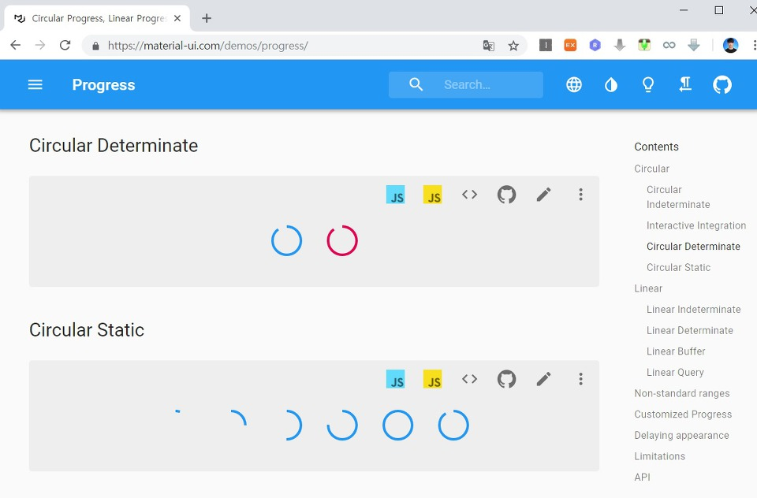
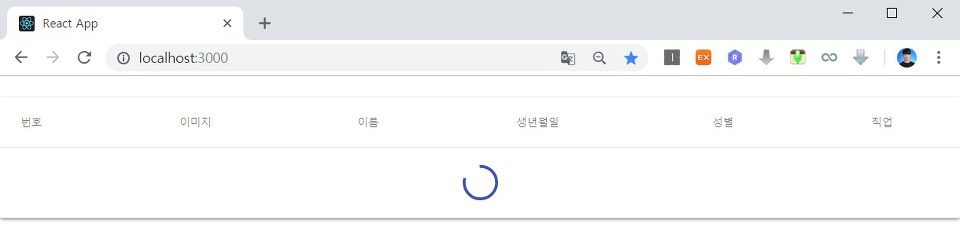
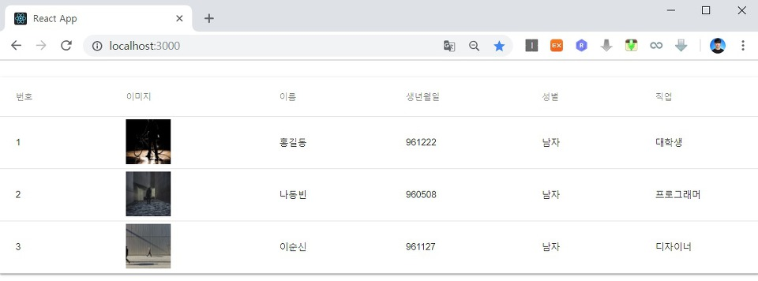

흔히 소프트웨어에서는 프로그레스 바(Progress Bar)를 구현하여 API 로딩 메시지를 웹 사이트 상에 출력할 수 있습니다. 이번 시간에는 고객 목록을 불러오는 API를 요청했을 때 서버에서 응답을 늦게 하는 경우 로딩 메시지를 화면에 띄워주는 방법에 대해서 알아보도록 하겠습니다. 프로그레스 바 UI 또한 Material UI에 이미 구현이 되어 있습니다. 따라서 이를 단순히 사용해주면 됩니다.

▶ Material UI 프로그레스 바: <https://material-ui.com/demos/progress/>

우리는 이 예제 중에서 [Determinate]을 선택해 구현해 보도록 하겠습니다.



※ React의 라이프 사이클(Life Cycle) ※

기본적으로 리액트 라이브러리가 처음 컴포넌트를 실행할 때는 다음의 순서를 따릅니다.

1. constructor()
2. componentWillMount()
3. render()
4. componentDidMount()

그리고 컴포넌트의 props 혹은 state가 변경될 때는 shouldComponentUpdate() 함수 등이 사용되어 실질적으로 다시 render() 함수를 불러와 뷰(View)를 갱신하게 됩니다. 또한 컴포넌트가 삭제될 때는 componentWillUnmount() 함수가 실행된다는 특징이 있습니다.

따라서 일반적으로 API를 불러와서 웹 사이트 화면에 특정한 뷰(View)를 출력하고자 한다면 componentDidMount() 함수에서 API를 비동기적으로 호출하면 됩니다. 이후에 API에서 응답(Response)이 돌아왔을 때 비로소 뷰(View)가 갱신되므로 화면에 API 응답 결과를 출력할 수 있는 것입니다. 비동기적으로 호출한다는 점에서 API 서버에서 응답을 하지 않으면 사용자에게 로딩 화면만 출력이 됩니다.

▶ App.tsx

따라서 Circular Progress 라이브러리를 이용하여 프로그레스 바를 API 로딩 메시지 용도로 사용하도록 하겠습니다.

```tsx
import React, { useState, useEffect } from "react";
import Customer from "./components/Customer";
import "./App.css";
import Paper from "@mui/material/Paper";
import Table from "@mui/material/Table";
import TableHead from "@mui/material/TableHead";
import TableBody from "@mui/material/TableBody";
import TableRow from "@mui/material/TableRow";
import TableCell from "@mui/material/TableCell";
import { createTheme } from "@mui/material/styles";
import { makeStyles } from "@mui/styles";
import CircularProgress from "@mui/material/CircularProgress";

const customTheme = createTheme({
  palette: {
    primary: {
      main: "#1976d2",
      contrastText: "white",
    },
  },
  spacing: 2,
});

const useStyles = makeStyles({
  root: {
    width: "100%",
    marginTop: customTheme.spacing(3),
    overflowX: "auto",
  },
  table: {
    minWidth: 700,
  },
  progress: {
    margin: customTheme.spacing(2),
  }
});

type AppProps = {
  key: number;
  id: number;
  image: string;
  name: string;
  birthday: string;
  gender: string;
  job: string;
};

function App() {
  const [customers, setCustomers] = useState<AppProps[]>([]);
  const [progress, setProgress] = React.useState(0);

  const fetchData = async () => {
    await fetch("/api/customers")
      .then((data) => data.json())
      .then((data) => setCustomers(data));
  };

  useEffect(() => {
    const timer = setInterval(() => {
      setProgress((prevProgress) => (prevProgress >= 100 ? 0 : prevProgress + 10));
    }, 800);

    fetchData();

    return () => {
      clearInterval(timer);
    };
  }, []);

  const classes = useStyles();
  return (
    <Paper className={classes.root}>
      <Table className={classes.table}>
        <TableHead>
          <TableRow>
            <TableCell>번호</TableCell>
            <TableCell>이미지</TableCell>
            <TableCell>이름</TableCell>
            <TableCell>생년월일</TableCell>
            <TableCell>성별</TableCell>
            <TableCell>직업</TableCell>
          </TableRow>
        </TableHead>
        <TableBody>
            {customers ?
              customers.map(c => {
                return <Customer key={c.id} id={c.id} image={c.image} name={c.name} birthday={c.birthday} gender={c.gender} job={c.job} />
              }) :
              <TableRow>
                <TableCell colSpan={6} align="center">
                  <CircularProgress className={classes.progress} variant="determinate" value={progress} />
                </TableCell>
              </TableRow>
            }
          </TableBody>
      </Table>
    </Paper>
  );
}

export default App;
```

※ 실행 결과 ※

API를 불러올 때의 화면입니다.



API가 불러와 졌을 때의 결과 화면입니다.



(+ 추가)

효과적인 로딩 테스트를 위해서는 서버 API의 지연을 발생시키는 것이 좋습니다. 서버에서 응답(Response) 데이터를 보내주는 코드에 Timeout을 적용해 보세요. setTimeout(function() { 소스 코드 }, 지연 시간)의 문법으로 간단히 사용해 볼 수 있습니다.

출처: https://ndb796.tistory.com/219?category=1030599 [안경잡이개발자]
