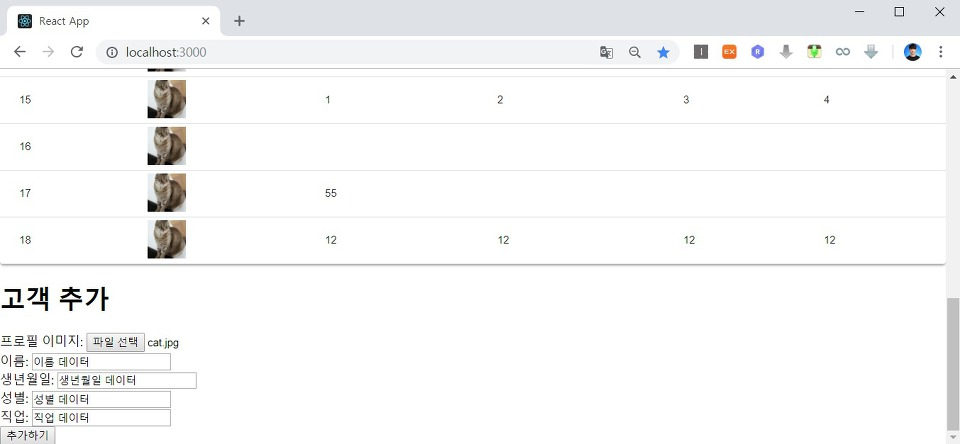
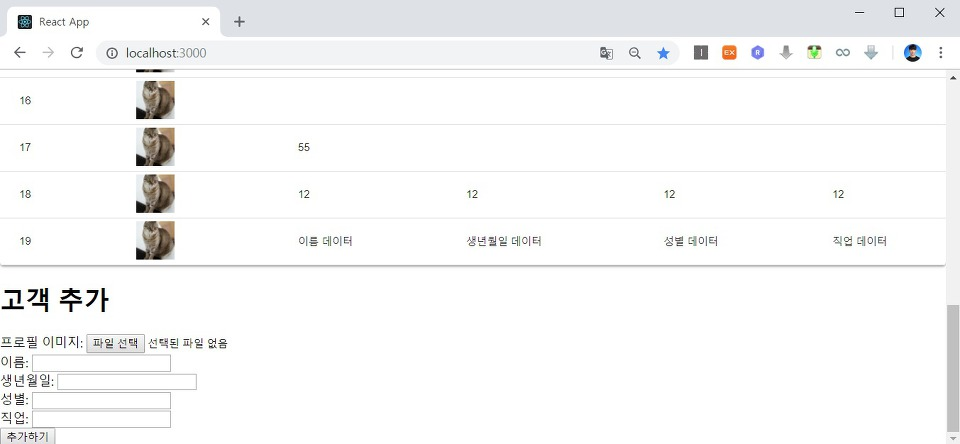

지난 시간까지 작성되었던 소스코드 상으로는 새로운 고객(Customer) 정보가 추가되면 페이지 새로고침(Refresh)를 통해서 새롭게 등록된 고객에 대한 정보를 확인할 수 있습니다. 하지만 기본적으로 리액트(React)는 SPA(Single Page Application)의 구조로 동작합니다. 그러므로 전체 페이지를 새로고침하는 것은 비효율적이며 고객 추가(Customer Add) 컴포넌트에서 부모 컴포넌트의 상태(State)를 변경하는 식으로 필요한 부분만 새로고침 되도록 설정하면 됩니다.

이 때는 기본적으로 부모 컴포넌트에서 자식 컴포넌트로 함수를 props로 건내주는 방식으로 구현합니다.

※ 전체 고객 목록 다시 불러오기 ※

고객 목록 추가 이후에 새로고침 하는 과정을 구현하는 가장 대표적인 방법은 전체 고객 목록을 다시 불러옴으로써 State를 갱신하는 방식입니다. App.tsx에 있던 기존의 state 초기화 변수를 제거해주신 뒤에, 윗 부분을 다음과 같은 소스코드로 채우시면 됩니다.

▶ App.tsx

```tsx
function App() {
  const [customers, setCustomers] = useState<AppProps[]>([]);
  const [progress, setProgress] = React.useState(0);

  const stateRefresh = () => {
    setCustomers([]);
    setProgress(0);
    fetchData();
  };
  ...
```

이후에 Customer Add 컴포넌트로 stateRefresh() 함수를 보내주시면 돼요. 그러면 Customer Add 컴포넌트가 해당 함수를 호출해서 부모 컴포넌트인 App 컴포넌트의 State를 갱신하게 됩니다. App.tsx 하단부 `<CustomerAdd/>` 부분을 수정해 줍니다.

```tsx
<CustomerAdd stateRefresh={this.stateRefresh} />
```

마지막으로 CustomerAdd.tsx로 가서 아래의 내용으로 수정합니다. 

참고:
[How to pass Functions as Props in React TypeScript](https://bobbyhadz.com/blog/react-typescript-pass-function-as-prop)

```tsx
import React, { useState } from "react";
import axios from "axios";

interface ICustomerAdd {
  stateRefresh: () => void;
}

function CustomerAdd({ stateRefresh = () => {} }: ICustomerAdd) {
  //const [file, setFile] = React.useState<File | null>(null);
  const [userName, setUserName] = useState<string>("");
  const [birthday, setBirthday] = useState<string>("");
  const [gender, setGender] = useState<string>("");
  const [job, setJob] = useState<string>("");
  const [fileName, setFileName] = useState<string>("");

  const handleFormSubmit = (e: React.FormEvent<HTMLFormElement>) => {
    e.preventDefault();
    addCustomer().then((response) => {
      console.log(response.data);
      stateRefresh();
    });

    setUserName("");
    setBirthday("");
    setGender("");
    setJob("");
  };
  ...
```

다만 고객 목록 데이터를 불러오는 과정은 비동기적으로 수행된다는 점에서 항상 고객 데이터를 추가(Add)한 이후에 고객 목록 데이터를 불러온다는 것을 보장하지 못합니다. 따라서 다음과 같이 고객 추가 이후에 서버로부터 응답을 받고 나서 비로소 고객 목록을 다시 불러오도록 설정해야 합니다.

```js
const handleFormSubmit = (e: React.FormEvent<HTMLFormElement>) => {
  e.preventDefault();
  addCustomer().then((response) => {
    console.log(response.data);
    stateRefresh();
  });

  setUserName("");
  setBirthday("");
  setGender("");
  setJob("");
};
```

이제 테스트를 진행 해보시면 다음과 같이 정상적으로 동작합니다.



추가 이후에는 전체 페이지 새로고침 없이 다음과 같이 고객 목록이 출력됩니다. 또한 고객 추가 창은 비워지게 됩니다.



※ 고객 정보 갱신 방법에 대해서 ※

위에서 구현한 방식은 고객 데이터가 많을 때에는 매 번 새로고침을 거치는 과정에서 리소스를 비효율적으로 사용하게 됩니다. 그래서 실제로 상용 서비스에 적용할 때는 최근 10개의 고객 목록만 가져오도록 하여, 이후의 고객 정보에 대해서는 스크롤을 통해 새롭게 불러오는 식으로 구현할 수 있습니다.

물론 이렇게 만든 고객 관리 시스템을 자기 혼자 사용하는 경우에는 매 번 서버와 통신하지 않아도 됩니다. 고객을 추가한 이후에 자신의 화면에서 바로 추가된 고객 정보만을 추가적으로 보여주면 됩니다.

하지만 일반적인 고객 관리 시스템은 여러 명의 관리자가 동시에 작업할 수 있다는 점에서 현재의 방법이 더 효율적일 수 있습니다.

출처: https://ndb796.tistory.com/229?category=1030599 [안경잡이개발자]
