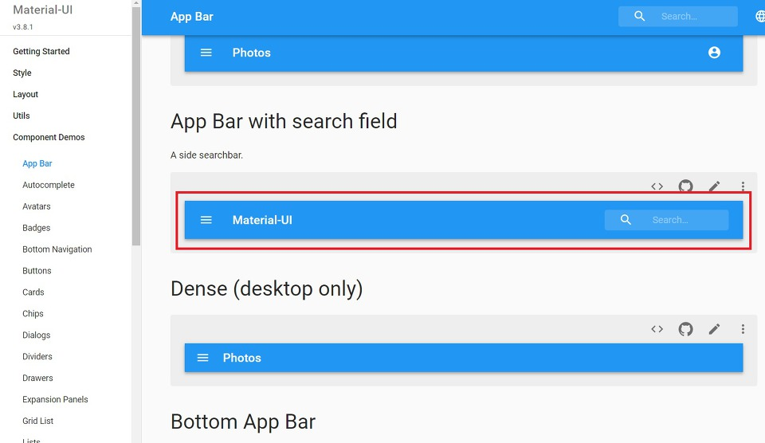
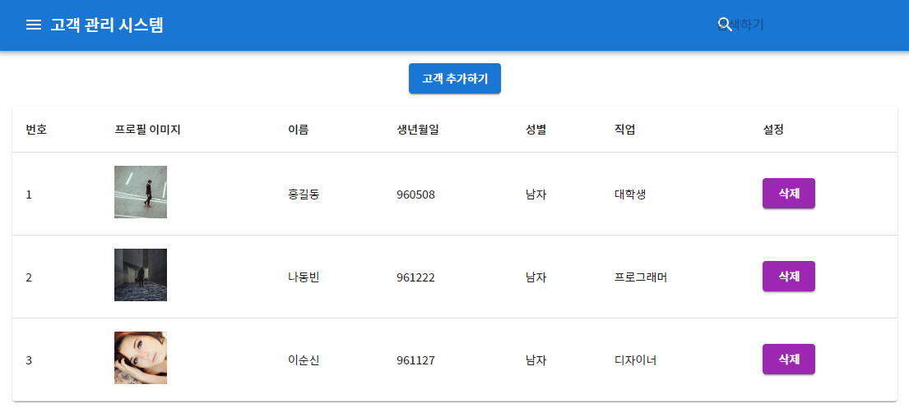

이번 시간에는 안정적인 UI/UX를 위해 AppBar을 적용하는 시간을 가져보도록 하겠습니다. AppBar는 검색 바, 내비게이션 바 등의 목적으로 사용됩니다. 따라서 가장 먼저 client 폴더로 이동해서 다음과 같은 명령어를 입력해서 icons 라이브러리를 받으면 됩니다.

▶ Material UI icons 다운로드 명령어

**@mui/icons-material 의 경우 npm 방식 설치가 불안정해 보인다. yarn을 통해 설치합니다.**
```
> yarn add @mui/icons-material

> yarn add @material-ui/icons
```

이제 코딩을 진행해보도록 하겠습니다. 우리가 적용할 AppBar는 React.js의 Material UI 공식 사이트에서 제공하고 있는 기본 예제입니다. 말 그대로 기본 예제라는 점에서 한글 웹 폰트(Web Font) 등은 적용되어 있지 않습니다. 따라서 우리가 직접 웹 폰트 등을 적용해야 합니다.

▶ Material UI AppBar 예제: https://material-ui.com/demos/app-bar/

우리는 아래에 보이는 App Bar with search field 예제를 넣어보도록 하겠습니다.



※ AppBar 적용하기 ※

▶ App.tsx

```js
import React, { useState, useEffect } from "react";
import Customer from "./components/Customer";
import "./App.css";
import Paper from "@mui/material/Paper";
import Table from "@mui/material/Table";
import TableHead from "@mui/material/TableHead";
import TableBody from "@mui/material/TableBody";
import TableRow from "@mui/material/TableRow";
import TableCell from "@mui/material/TableCell";
import { createTheme } from "@mui/material/styles";
import { makeStyles } from "@mui/styles";
import CircularProgress from "@mui/material/CircularProgress";
import CustomerAdd from "./components/CustomerAdd";
import MenuIcon from "@mui/icons-material/Menu";
import SearchIcon from "@mui/icons-material/Search";
import InputBase from "@mui/material/InputBase";
import Typography from "@mui/material/Typography";
import AppBar from "@mui/material/AppBar";
import Toolbar from "@mui/material/Toolbar";
import IconButton from "@mui/material/IconButton";

const customTheme = createTheme({
  palette: {
    primary: {
      main: "#1976d2",
      contrastText: "white",
    },
  },
  spacing: 2,
});

const useStyles = makeStyles({
  root: {
    width: "100%",
    marginTop: customTheme.spacing(3),
    overflowX: "auto",
  },
  menu: {
    marginTop: 15,
    marginBottom: 15,
    display: "flex",
    justifyContent: "center",
  },
  paper: {
    marginLeft: 18,
    marginRight: 18,
  },
  progress: {
    margin: customTheme.spacing(3),
  },
  grow: {
    flexGrow: 1,
  },
  tableHead: {
    fontSize: "1.0rem",
  },
  menuButton: {
    marginLeft: -12,
    marginRight: 20,
  },
  title: {
    display: "none",
    [customTheme.breakpoints.up("sm")]: {
      display: "block",
    },
  },
  search: {
    position: "relative",
    borderRadius: customTheme.shape.borderRadius,
    marginLeft: 0,
    width: "100%",
    [customTheme.breakpoints.up("sm")]: {
      marginLeft: customTheme.spacing(3),
      width: "auto",
    },
  },
  searchIcon: {
    width: customTheme.spacing(3),
    height: "100%",
    position: "absolute",
    pointerEvents: "none",
    display: "flex",
    alignItems: "center",
    justifyContent: "center",
  },
  inputRoot: {
    color: "inherit",
    width: "100%",
  },
  inputInput: {
    paddingTop: customTheme.spacing(3),
    paddingRight: customTheme.spacing(3),
    paddingBottom: customTheme.spacing(3),
    paddingLeft: customTheme.spacing(10),
    width: "100%",
    [customTheme.breakpoints.up("sm")]: {
      width: 120,
      "&:focus": {
        width: 200,
      },
    },
  },
});

type AppProps = {
  key: number;
  id: number;
  image: string;
  name: string;
  birthday: string;
  gender: string;
  job: string;
  open: boolean;
};

function App() {
  const [customers, setCustomers] = useState<AppProps[]>([]);
  const [progress, setProgress] = React.useState(0);

  const stateRefresh = () => {
    setCustomers([]);
    setProgress(0);
    fetchData();
  };

  const fetchData = async () => {
    await fetch("/api/customers")
      .then((data) => data.json())
      .then((data) => setCustomers(data))
      .catch((err) => console.log(err));
  };

  useEffect(() => {
    const timer = setInterval(() => {
      setProgress((prevProgress) =>
        prevProgress >= 100 ? 0 : prevProgress + 10
      );
    }, 800);

    fetchData();

    return () => {
      clearInterval(timer);
    };
  }, []);

  const classes = useStyles();
  const cellList = [
    "번호",
    "프로필 이미지",
    "이름",
    "생년월일",
    "성별",
    "직업",
    "설정",
  ];
  return (
    <div>
      {" "}
      <AppBar position="static">
        <Toolbar>
          <IconButton
            className={classes.menuButton}
            color="inherit"
            aria-label="Open drawer"
          >
            <MenuIcon />
          </IconButton>
          <Typography
            className={classes.title}
            variant="h6"
            color="inherit"
            noWrap
          >
            고객 관리 시스템
          </Typography>
          <div className={classes.grow} />
          <div className={classes.search}>
            <div className={classes.searchIcon}>
              <SearchIcon />
            </div>
            <InputBase
              placeholder="검색하기"
              classes={{
                root: classes.inputRoot,
                input: classes.inputInput,
              }}
            />
          </div>
        </Toolbar>
      </AppBar>
      <div className={classes.menu}>
        <CustomerAdd stateRefresh={stateRefresh} />
      </div>
      <Paper className={classes.paper}>
        <Table>
          <TableHead>
            <TableRow>
              {cellList.map((c) => {
                return <TableCell className={classes.tableHead}>{c}</TableCell>;
              })}
            </TableRow>
          </TableHead>
          <TableBody>
            {customers ? (
              customers.map((c) => {
                return (
                  <Customer
                    stateRefresh={stateRefresh}
                    key={c.id}
                    id={c.id}
                    image={c.image}
                    name={c.name}
                    birthday={c.birthday}
                    gender={c.gender}
                    job={c.job}
                    open={c.open}
                  />
                );
              })
            ) : (
              <TableRow>
                <TableCell colSpan={6} align="center">
                  <CircularProgress
                    className={classes.progress}
                    variant="determinate"
                    value={progress}
                  />
                </TableCell>
              </TableRow>
            )}
          </TableBody>
        </Table>
      </Paper>
    </div>
  );
}

export default App;
```

▶ index.css

index.css에서는 Note Sans KR 글씨체를 웹 폰트 형태로 불러오게 됩니다.

```css
@import url(http://fonts.googleapis.com/earlyaccess/notosanskr.css);

body {
  margin: 0;
  padding: 0;
  font-family: "Noto Sans KR", -apple-system, BlinkMacSystemFont, "Segoe UI", "Roboto", "Oxygen",
    "Ubuntu", "Cantarell", "Fira Sans", "Droid Sans", "Helvetica Neue",
    sans-serif;
  -webkit-font-smoothing: antialiased;
  -moz-osx-font-smoothing: grayscale;
}

code {
  font-family: source-code-pro, Menlo, Monaco, Consolas, "Courier New",
    monospace;
}
```

▶ index.tsx

이제 index.tsx에서는 Material UI의 테마 폰트로 "Note Sans KR"을 적용해주면 됩니다. 이렇게 해주지 않으면 곳곳에 사용된 Material UI에 전체적인 폰트 적용이 안 될 수도 있습니다.

```tsx
import React from "react";
import ReactDOM from "react-dom/client";
import "./index.css";
import App from "./App";
import { createTheme, ThemeProvider } from "@mui/material/styles";

const theme = createTheme({
  typography: {
    fontFamily: '"Noto Sans KR", serif',
  },
});

const root = ReactDOM.createRoot(
  document.getElementById("root") as HTMLElement
);
root.render(
  <ThemeProvider theme={theme}>
    <App />
  </ThemeProvider>
);
```

※ 실행 결과 ※

결과적으로 다음과 같이 전체적인 UI가 Material한 형태로 업데이트 되었습니다.



출처: https://ndb796.tistory.com/232?category=1030599 [안경잡이개발자]
