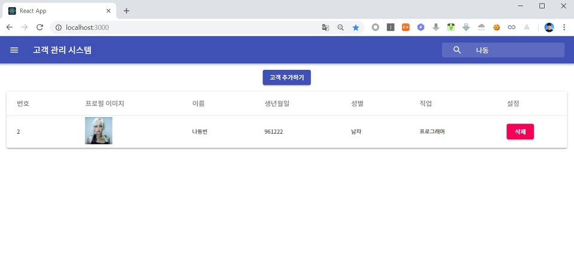

이번 시간에는 필터(Filter) 함수를 이용하여 고객(Customer) 검색 기능을 구현하는 방법에 대해서 알아보도록 하겠습니다.

▶ App.tsx

`searchKeyword` 값도 추가합니다.

```tsx
const [searchKeyword, setSearchKeyword] = React.useState("");
```

이후에 `<InputBase>` 에서 다음과 같이 작성합니다.

```tsx
<InputBase
  placeholder="검색하기"
  classes={{
    root: classes.inputRoot,
    input: classes.inputInput,
  }}
  name="searchKeyword"
  value={searchKeyword}
  onChange={(e) => {
    setSearchKeyword(e.target.value);
  }}
/>
```

지금까지는 단순히 고객 스테이트가 변경되면 전체 고객을 바로 보여주는 식으로 코드가 동작했습니다. 이제는 전체 고객 컴포넌트를 생성하는 부분을 return() 함수의 가장 윗 부분에서 새롭게 명시해주도록 하겠습니다.

```tsx
const filteredComponents = (data: AppProps[]) => {
  data = data.filter((c: AppProps) => {
    return c.name.indexOf(searchKeyword) > -1;
  });
  return data.map((c: AppProps) => {
    return (
      <Customer
        stateRefresh={stateRefresh}
        key={c.id}
        id={c.id}
        image={c.image}
        name={c.name}
        birthday={c.birthday}
        gender={c.gender}
        job={c.job}
        open={c.open}
      />
    );
  });
};
```

이후에 <TableBody> 부분을 다음과 같이 작성하면 됩니다.

```tsx
<TableBody>
  {customers ? (
    filteredComponents(customers)
  ) : (
    <TableRow>
      <TableCell colSpan={6} align="center">
        <CircularProgress
          className={classes.progress}
          variant="determinate"
          value={progress}
        />
      </TableCell>
    </TableRow>
  )}
</TableBody>
```

마지막으로 새로운 고객이 추가된 경우 검색 창 내용도 비워질 수 있도록 처리하겠습니다.

```js
const stateRefresh = () => {
  setCustomers([]);
  setProgress(0);
  setSearchKeyword("");
  fetchData();
};
```

※ 실행 결과 ※




출처: https://ndb796.tistory.com/254?category=1030599 [안경잡이개발자]
