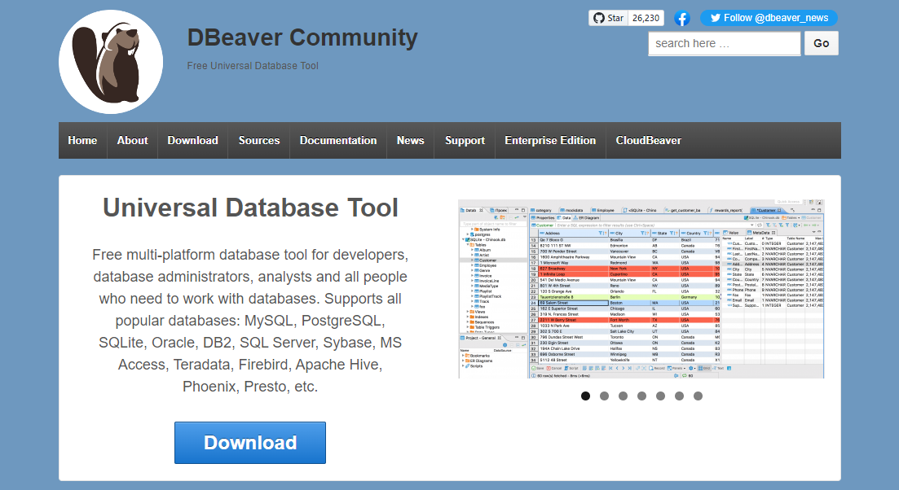
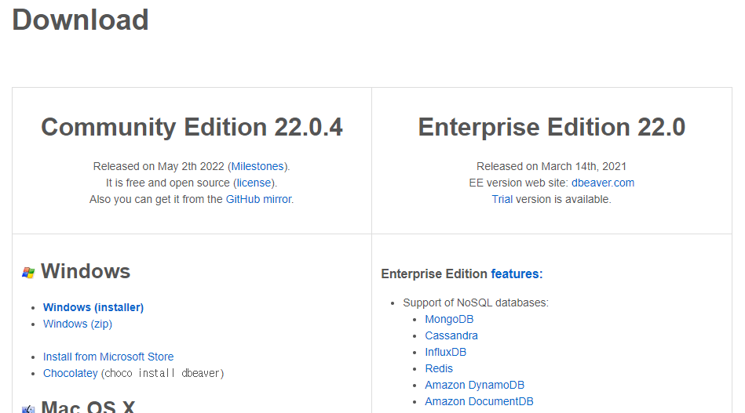
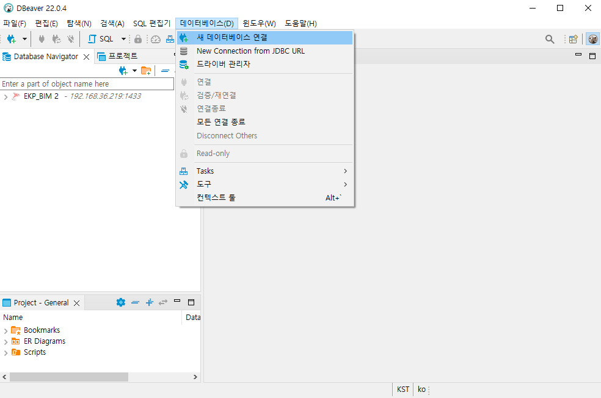
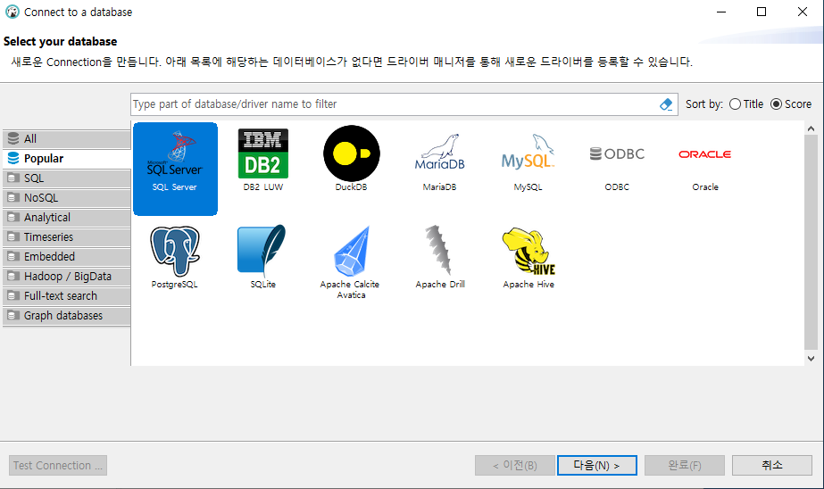
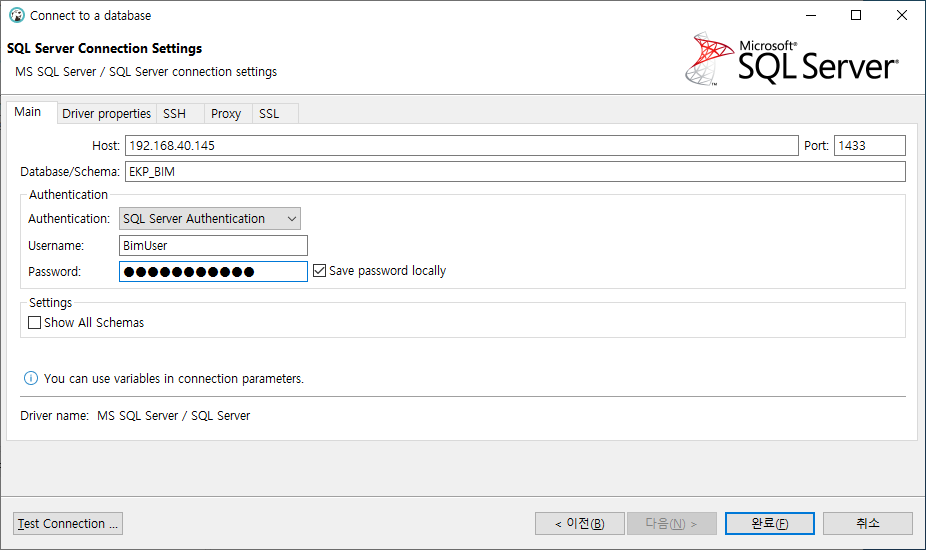
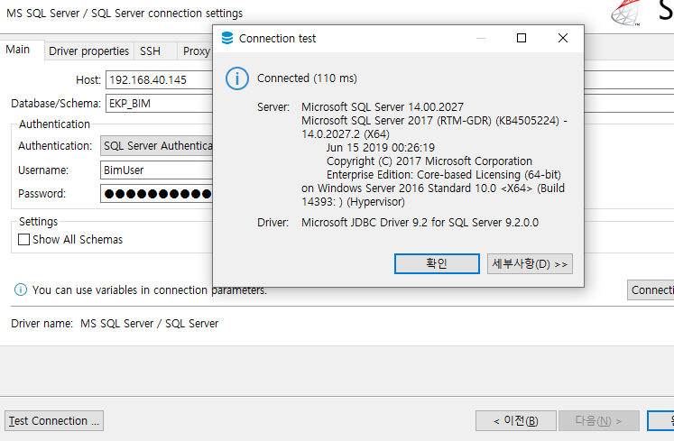
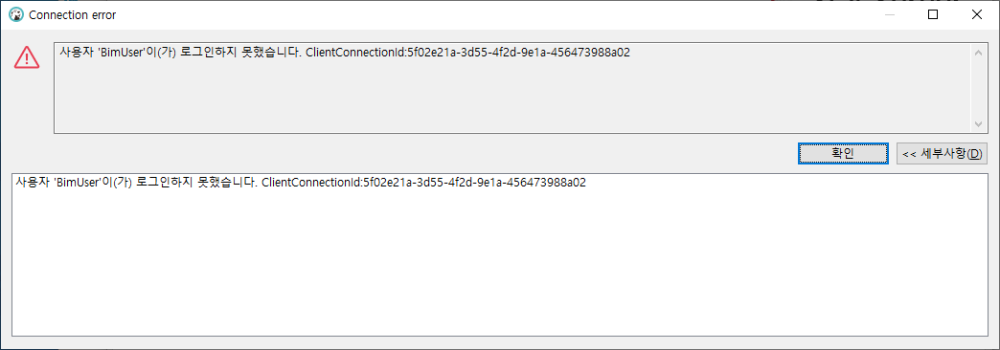
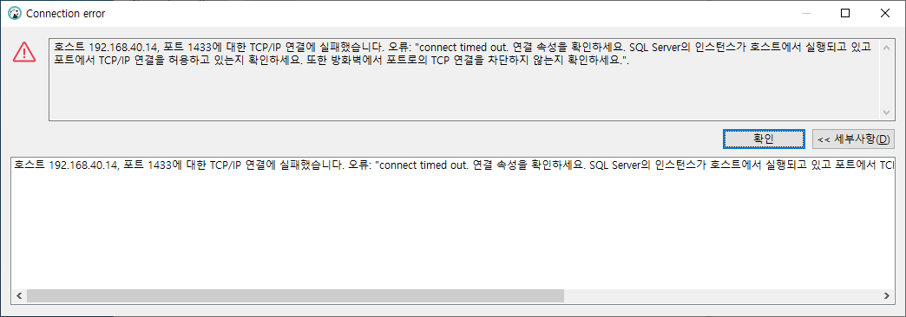
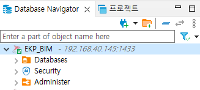

Haeahn 주 DB는 MSSQL 입니다. 개발/ 테스트DB에 새로운 DB 및 테이블 생성 과정을 설명하겠습니다. 

먼저, DB접속 소프트웨어를 설치하겠습니다. 

회사에서 상업적으로도 사용 가능한 도구인 'DBeaver'를 사용하겠습니다. SQL을 사용하지 않더라도 UI 상에서 직접 데이터 조작이 가능한 부분, 다양한 DB 종류 연결을 지원한다는 점 때문에 선택하게 되었습니다. 만약 다른 익숙한 DB 클라이언트가 있다면 그것을 사용해도 좋습니다. 

<https://dbeaver.io/> 로 접속하여 프로그램을 다운로드 받습니다.

사이트에 접속후 Download 페이지로 이동합니다.

현재 최신버전은 `Community Efition 22.0.4` 이고, `Windows (Installer)`를 클릭하여 설치파일을 다운받고, 다음, 다음을 눌러 설치를 마칩니다.

DBeaver 를 실행하여 `데이터베이스 > 새 데이터베이스 연결`을 누릅니다.

목록에서 `Microsoft SQL Server`를 선택하고 다음을 누릅니다. 

아래 내용을 입력하고 `Test Connection...` 버튼을 누릅니다.

* Host: 192.168.40.145
* Database/ Schema: EKP_BIM
* Username: BimUser
* Password: `<관리자 문의>`

정보가 정확히 입력되었다면 이와 같이 나옵니다. 확인을 눌러 Test 창을 닫고 완료를 눌러 연결을 완료합니다.

비밀번호가 잘못되었다면 이와 같이 나올겁니다.

네트워크 상태가 좋지 못하거나 IP주소가 잘못되었다면 이과 같은 메시지가 나옵니다.

정상적으로 연결되었다면 EKP_BIM 이라는 연결이 추가되었습니다.

