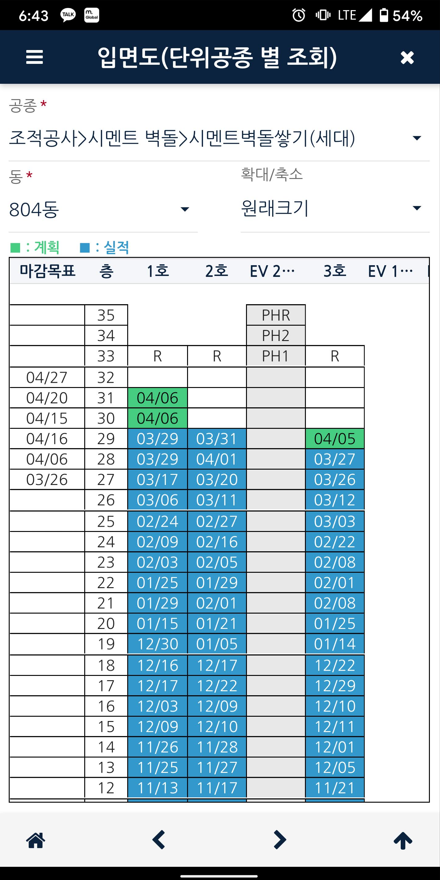

# 업무, 이슈, 관리, 계획, 공유 등

## github

- Pro의 특징
- Pro를 활용해보자
- gitpage 운용 사례
- 테스트 배포는 vercel 이용 (소스는 github 이용)

## gitpages

- 연구 내용 정리
- 업무 내용 정리
- 보고 일원화

## vs code

- VS CODE 활용하기
- 업무 정리 방법 공유
- gitpage 와 연결하기

## 프로젝트관리

- 2~4인 그룹 프로젝트 수행
- 월 단위 Activity 관리
- 월말 23~25일 경 진행상황 점검
- 이슈 및 진도, 결과 공유
- 다음달 문제 업무 기획

## 검토 아이템

- 대시보드 2차
- 라이브러리 조회
- 업무형태기반 실행공정표추출
- CAD기반 건축개요표 추출/ DB화

## 회면 기획

- 대시보드 2차
- 라이브러리 조회
- 업무형태기반 실행공정표추출

## 담당업무

- 웹개발
- 애드인개발
- 기획
- 데이터분석
- DB운영
- 디자인
- 퍼블리싱

## 데이터 기획

- 수집 루트 기획
- 수집 데이터 기획
- 데이터 관련성 검토
- 연결 가능성 검토 (KEY, TEXT)
- 데이터 시작점, 활용파트, 수정불가영역, 삭제가능영역 등 검토
- 데이터 흐름, 프로세스 기획

## 데이터 분석

## 배포 관리

## 외주 기획

## 업무 정리 사이트

## 인증서 관리
