`2022.03.29`
`JavaScript React`

1. [Visual Studio Code](https://code.visualstudio.com/) 설치 (이하 `VS Code`)  
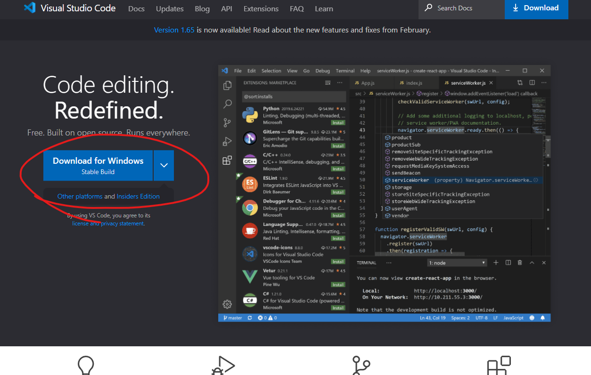

2. [node.js](https://nodejs.org/ko/) 설치  
   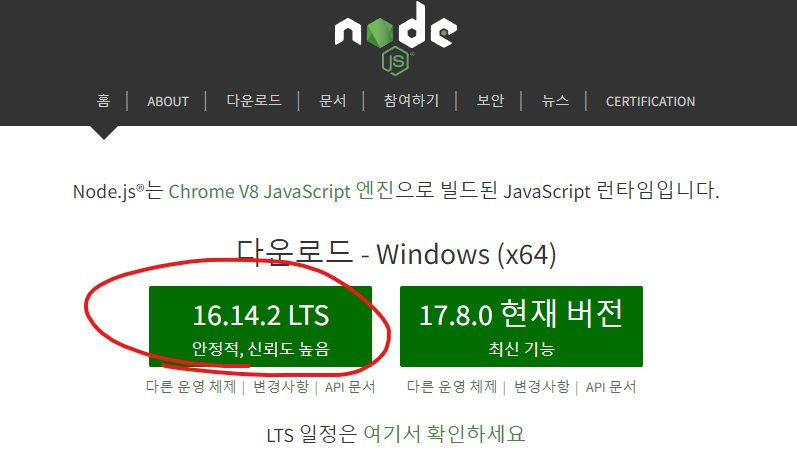

3. VS Code 실행
4. `F1` 키 > 'Git: Clone' 선택  
   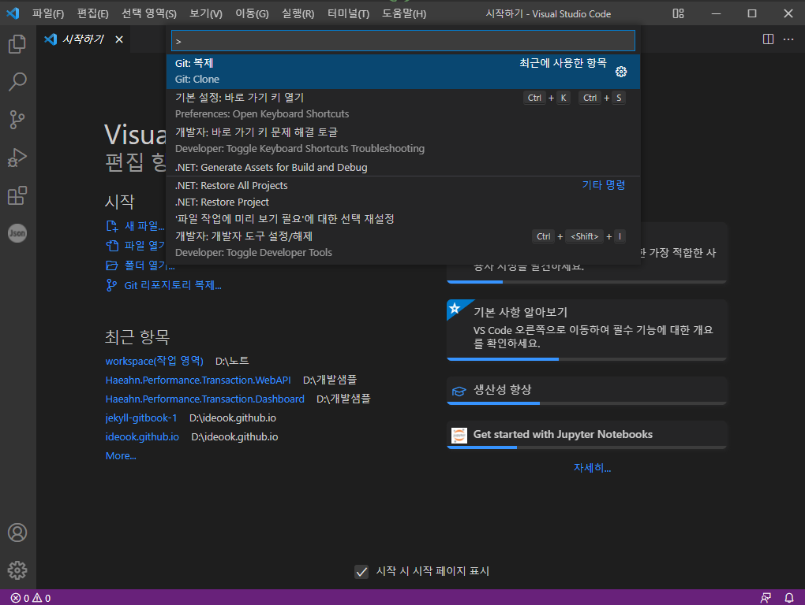

5. git 경로 입력  
   https://github.com/HaeahnBIM/Haeahn.Performance.Transaction.Dashboard.git  

   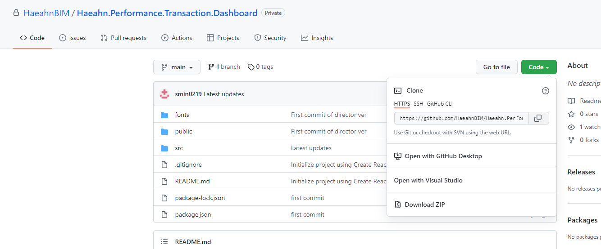  

   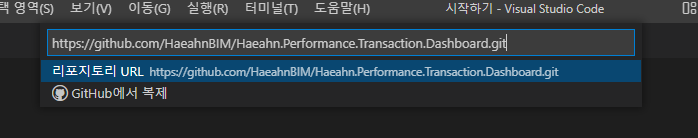  

6. 클론 받을 PC 경로 선택  
   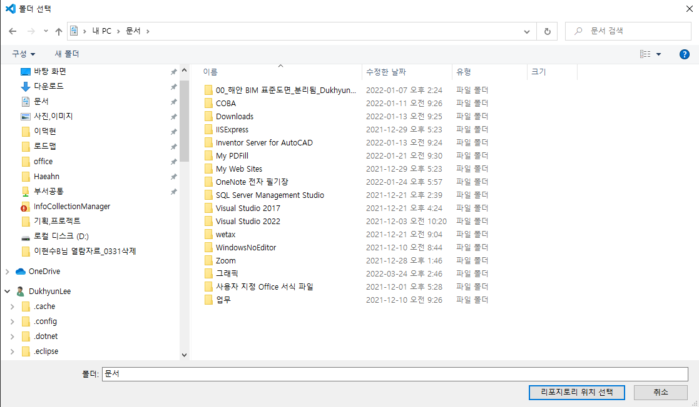  

7.  클론 중  
   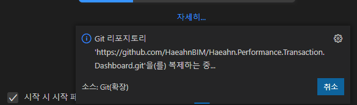

8. 열기  
   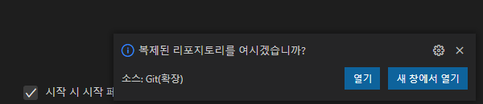

9. 파일 신뢰 여부 선택  
    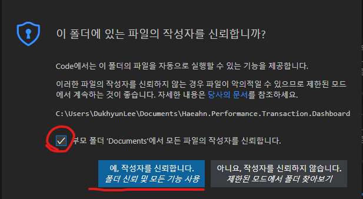

10. [ Ctrl + ` ] 입력 또는 [보기 > 터미널] 선택하여 터미널 열기  
    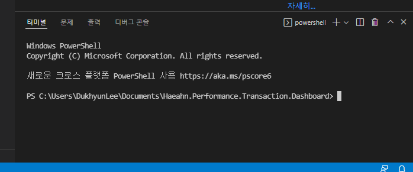

11. 모듈 설치 
    1. 터미널 `npm i react-scripts` 입력  
    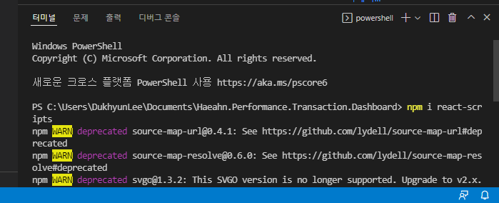  

    2. 터미널 `npm i moment` 입력  
    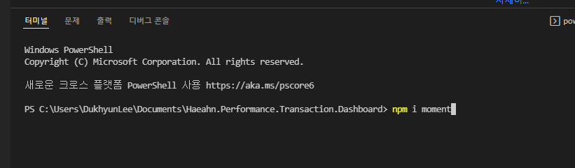

12. 터미널 `npm start` 입력