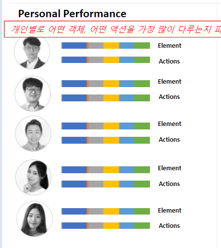
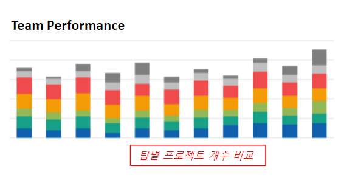

## 데시보드 상세 기획
`내용 GOOD`
- 각 컨텐츠 세부 정의 필요, 발주자의 기획서로서는 훌륭
- 
- 

### Persinal
- Element/ Action Name은 어떻게 표현할 것인지
- 몇 개까지 차트에 나오도록 할것인지
- 또는 평균 이상의 유형만 보여줄 것인지
- 인원 필터링은 가능한지
- 필터링 기능은 어떤 형태인지
- 인원이 많아지만 스크롤로 보여줄 것인지
- 이름은 안 보여줄 것인지

### Team
- 가로/ 세로축은 어떤걸 의미하는지
- 이 대시보드는 PM이 대상인지, 부문장이 대상인지
- 팀이 하나라면 어떻게 나오는지

## 레빗 시트작업
- 어떤 시트 작업을 했는지
