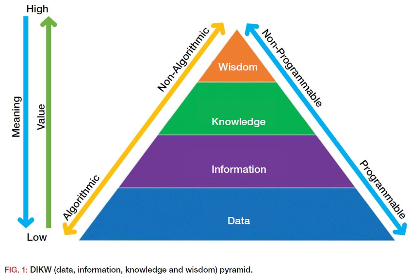

- AutoCAD 기능 너무 좋아졌음. 기능 파악 필요
- CAD 자동화의 기본
- 교육 수강 현황 명부를 관리했었음. EXCEL
- 강의자료 제작에 품이 너무 많이 들어감
- 업체, 프로젝트, 부재, 분야 등 명명규칙 잘 지쳐지지 않는다.
- 정해진 기준으로 검토 Rule Set을 만들어야 함, QA/ QC 범위
- QA/ QC를 해야할까? 명명 규칙이 중요한 것인가?
- 담당자, 책임자가 변경이 되어도 그 안의 내용은 바뀌지 않도록 해야함
- 회사 표준은 보안자료 인가?
- 보안 사고가 난 경우가 있었는가?
- 현재의 보안, 비보한 자료 구분
- 진짜 보안 수준, 비보안 수준 구분
- 프로젝트 시작을 위한 준비자료, preset내용, 기준 내용 등 확보 및 시스템기반 체크리스트
- 시스템 만들면 내부에서 알파, 베타 검토 후 본 시스템 재 기획
- 경영회의에서는 난리도 아님. 설계 실수가 상당히 많음
- 모델링 이력을 통해서 프로젝트 평균 생산성 계산, 타 프로젝트 모델링 일정 계산하기
- 여태 모델링이나 설계를 했는데 잘 한 것 맞는가. 그걸 프로젝트 정보 모아서 분석할 수 있을까?

## 개발

기간을 가진 로드맵을 만들기에는 변수가 너무 많고 지킬 수 있을지 의문이다. 데이터 중심으로 생각해야 한다?? 데이터 및 시스템 기반으로 업무방식을 전환해야 한다?? 어떤 예시가 있을까.

BIM만 하는 곳은 아니다. 즉, BIM데이터만 가지고 놀면 안된다.

설계 방식, 프로세스 패러다임 변화

설계 방식을 제3자가 적극적으로 바꾸려 하면 안된다. 이유는 알것이다.  

진행중인 데이터가 수집되어야 하는 이유, 끝나기 전에 문제를 찾아야 낭비를 최소화 할 수 있다.

> 성과 대시보드는 모두를 위한 것이어야 한다

직원들의 업무에서 의미를 찾고, 계속 동기가 부여되도록 만들기 위해서는 기업 성과에 이들이 기여한 바를 확인할 수 있도록 만드는 것이 아주 중요하다. 직원들이 매출과 이익, 고객 수에 대한 데이터에 접근할 수 있도록 만든다. 이는 데이터라는 개념을 더 잘 이해하도록 만드는 한편 동기를 부여하는 데 도움을 준다. 이를 전사적으로 사용하는 대시보드에 통합, 최종 사용자의 호기심을 불러일으키고, 이들이 데이터 기반 문화 구축에 더 적극적으로 참여하도록 만들 수 있다.

> 데이터에 친숙한 문화를 육성한다

‘데이터’에 대한 개념이 불투명하고, 여기에 위압감을 느낄 수도 있다. 데이터가 IT 종사자와 데이터 사이언티스트를 위한 개념이라고 생각하는 사람들이 많다. 이런 잘못된 통념을 없애고, 데이터를 즐겁게 받아들이도록 만들기 위해 기업은 개인이 주목하고 싶어할 경쾌하고 개인적인 매트릭스를 제시할 수 있다.

원문보기:
https://www.ciokorea.com/news/183974#csidxcecdb0899c23708bd710f0fcbaa5266

- 기업에 필요한 데이터가 쉽게 이용 가능한가?
- 어떤 유형의 데이터가 필요한가? 당신이 잘 모르는 광범위하고 다양한 데이터 세트가 존재하는가?
- 데이터가 깨끗하고, 현재성이 있으며, 믿을만하고, 기존 시스템과 통합될 수 있는가?
- 나머지 최고 경영진이 데이터 담당자의 방식에 동조하는가?
- 데이터 과학자와 최종 소비자가 ‘필요한 것’과 ‘전달되고 있는 것’에 대해 효과적으로 소통하고 있는가?
- 데이터는 어떻게 공유되고 있는가?
- 데이터를 어떻게 신뢰할 수 있는가?
- 데이터에 접근해야 하는 모든 사람들과 조직이 데이터를 사용할 권리를 가지고 있는가?

### DIKW 피라미드

세상에 데이터 없는 지식이 있을까?
- 지식이 만들어 지려면 데이터가 있어야 한다.
- 데이터가 없는 사람은 지식이 없다.
- 지식이 

- 데이터(data) : 단순한 사실의 나열

홈페이지 이용률을 관찰함에 있어서 얻어지는 이용자수, 연령, 시간, 성별 등의 각각의 정보들이  해당합니다.

- 정보(information) : 의미있는 데이터

이 데이터를 가지고 있는 패턴 또는 모델에 적용하고 분석하여 나온 결과입니다. 예컨대, 데이터를 살펴보니, 오늘의 방문이용자수는 3천명, 어제는 2만명, 하지만 평균 일일 이용자는  2천명이라는 사실 알게 되는 것은 우리에게 정보를 제공해주는 것입니다.

- 지식(knowledge) : 가치있는 정보

여기에서 이용자수를 가지고 왜 어제의 이용자수와 , 한 달 전의 이용자가 어떻게 차이가 나는지 분석 합니다. 알고 보니 3월 신학기에는 학교에서 홈페이지에서 서비스 하는 콘텐츠를 이용하는 경우가 많아서 이용자수가 급증하게 되어 다른 달에 비해 이용률이 증가하였다는 것을 알게 됩니다. 이에 이런  내용을 활용하여 더 많이 학교에 홍보하여 이용률을 높인다면 이것이 바로 지식이라고 볼수 있습니다.

- 지혜(wisdom) : 패턴화된 지식

이러한 지식을 바탕으로 각 월별 데이터를 분석해보고, 나름 패턴을 찾아내서 신규 콘텐츠 도입 시기,  방학시기 등의 이용자 수요의 변화를 찾아냅니다. 이러한 지식에서 이용자수는 신규콘텐츠 도입과 홍보가 중요한 요인임을 발견하고, 홍보의 새로운 방안이나, 타 분야와 응용해서 새로운 아이디어를  창출합니다.

### 업무 구분

- 프로젝트 셋팅
- 변환, 정리
- 집계, 보고
- 탬플릿, 라이브러리 조회
- 탬플릿, 라이브러리 작성
- 모델링
- 도면작성
- 검토
- 출력, 인쇄

### 절차 구분

-

### 데이터 구분

- 프로젝트 목록
- 공간 데이터
- 모델링 로그
- 프로젝트 건축개요
- 프로젝트모델 정보
- 프로젝트모델 3D
- 실내마감 정보
- 패밀리 정보
- 패밀리 3D
- 재료 정보
- 자재 정보
-

설계 고도화, 설계 방법 혁신, know-how, knowledge 수집, 그를 통한
