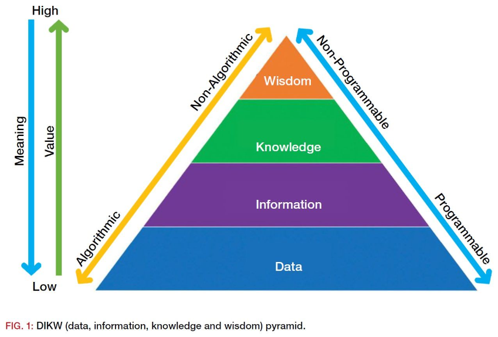

## 데이터기반 설계

- BIM만 하는 곳은 아니다. 즉, BIM데이터만 가지고 놀면 안된다.
- 그렇지만 BIM을 하면 이런 것이 나온다. 라는 것을 어필하자. BIM을 강요하는 것이 아니다.
- 설계사에서는 BIM을 해서 얻는 것이 그닥 없다고 느끼고 있다.
- 품질이 좋아지고, 정합성이 우수하고, 변화가 빠르고, 많은 도면을 뽑을 수 있고..?
- 이것들과 차원이 다른 무언가가 있어야 한다.
- 설계 방식과 프로세스 패러다임의 변화를 줘보자.
- 설계 방식을 제3자가 적극적으로 바꾸려 하면 안된다. 이유는 알것이다. 적극적이지 않은 관여
- 현재도 데이터기반 설계는 이루어지고 있다. 그 데이터가 안 보일 뿐이다.
- 그렇다면 현재는 데이터가 어디에 있는가? 머릿속에

## 데이터-지식

세상에 데이터 없는 지식이 있을까?

- 데이터가 쌓여야 지식이 만들어진다.
- 데이터가 없으면 지식이 없다.
- 데이터가 없는 사람은 지식이 없다.
- 데이터가 없는 사원급은 지식이 없다.
- 데이터가 없는 사원급은 지식 기반의 업무는 못한다.
- 데이터가 없는 소장도 지식 기반의 업무는 못한다.
- 데이터가 없는 소장은 없다.
- 데이터를 가진 사람을 통해 지식 기반 업무가 가능하다.
- 데이터를 가진 사람이 없으면 지식 기반 업무를 못한다.
- 데이터를 가진 사람이 없어지면 업무가 중단된다.

디자인 회사나 연구원이 아니기 때문에 업무의 90프로는 자료 찾기와 적용하는 것이다. 데이터가 많고 잘 찾는 사람이 일을 잘할수 밖에 없다.

### DIKW 피라미드

- 데이터(data) : 단순한 사실의 나열
- 정보(information) : 의미있는 데이터
- 지식(knowledge) : 가치있는 정보
- 지혜(wisdom) : 패턴화된 지식

## 데이터와 정보의 유형

### 산출물, 결과

| 원본 | 구분                 | 분류                       |
| ---- | -------------------- | -------------------------- |
| 도면 | 도면목록             | 용도, 규모, 프로젝트별     |
|      | 건축개요             | 설계단계, 용도, 지역, 이력 |
|      | 내/외부 마감재료정보 | 실내마감재료, 입면도 외장  |
|      | 단면상세             | 부위, 실, 재료명           |
|      | 하드웨어스팩         | 유형, 설치 부재            |
|      | 레이어정보           | 표준, 사용/미사용          |
|      | 실 목록              | 프로젝트, 동, 층, 실 유형  |
|      | 블럭 이미지, 이름    | 유형, 배치 위치(층, 실)    |
|      | 블럭 수량            | 유형, 층, 실               |
|      | 실 위치              | 동, 층, 주변 실            |
|      | 실 관계              | 주변 실                    |
| BIM  | 부재 유형            | ...                        |
|      | 부재 수량            | ...                        |
|      | ...                  | ...                        |

### 사용자 행동

| 원본  | 구분             | 분류                 |
| ----- | ---------------- | -------------------- |
| Revit | 추가, 수정, 삭제 | 부재, 부위, 프로젝트 |
|       | 시간             | 일, 월, 연           |

### 기본

레빗, 오토캐드, 라이노, 스케치업 등 설계업무에 활용되는 모든 소프트웨어를 확인하여야 올바른 컨설팅 방향을 정할 수 있으며, 라이선스 수량을 정밀하게 파악하여 계약시 활용할 수 있다.

| 원본            | 구분          | 분류                     |
| --------------- | ------------- | ------------------------ |
| 인사            | 개인정보      | 직급, 부문               |
| 프로젝트        | 목록          | 프로젝트명, 용도, 규모   |
|                 | 참여인원      | 프로젝트명, 용도, 규모   |
| 소프트웨어 현황 | 목록          | 소프트웨어명, 용도, 부문 |
|                 | 사용현황      | 소프트웨어명, 용도, 부문 |
|                 | 라이선스 정보 | 소프트웨어명, 용도, 부문 |

## 데이터 수집

- 경영회의에서는 많은 이슈가 오간다.
- 진행중인 프로젝트의 이슈가 오간다.
- 끝나고 이슈가 발견되면 더 큰일이다.
- 진행중인 데이터가 수집되어야 하는 이유

| 원본               | 구분                | 수집 방법                     |
| ------------------ | ------------------- | ----------------------------- |
| 도면               | 종료(이관) 프로젝트 | 이관 자료 접근 및 기계적 수집 |
|                    | 진행중 프로젝트     | 진행서버 접근 및 기계적 수집  |
| BIM                | 종료(이관) 프로젝트 | 이관 자료 접근 및 기계적 수집 |
|                    | 진행중 프로젝트     | 진행서버 접근 및 기계적 수집  |
| LOG                | 진행중 프로젝트     | 실시간 데이터, HBL            |
| 소프트웨어사용현황 | -                   | 전산관리 소프트웨어           |

## 데이터 전파 및 해택

> 데이터에 친숙한 문화를 육성한다

'데이터'에 대한 개념이 불투명하고, 여기에 위압감을 느낄 수도 있다. 데이터가 IT 종사자와 데이터 사이언티스트를 위한 개념이라고 생각하는 사람들이 많다. 이런 잘못된 통념을 없애고, 데이터를 즐겁게 받아들이도록 만들기 위해 기업은 개인이 주목하고 싶어할 경쾌하고 개인적인 매트릭스를 제시할 수 있다.

> 성과 대시보드는 모두를 위한 것이어야 한다

직원들의 업무에서 의미를 찾고, 계속 동기가 부여되도록 만들기 위해서는 기업 성과에 이들이 기여한 바를 확인할 수 있도록 만드는 것이 아주 중요하다. 직원들이 현황, 통계 및 분석 결과를 접근할 수 있어야 한다. 이는 데이터라는 개념을 더 잘 이해하도록 만드는 한편 동기를 부여하는 데 도움을 준다. 이를 전사적으로 사용하는 대시보드에 통합, 최종 사용자의 호기심을 불러일으키고, 이들이 데이터 기반 문화 구축에 더 적극적으로 참여하도록 만들 수 있다.

## 이야기

데이터는 일부의 전유물이 아니다.
애드인은 쓸만한 것 선정해서 기획 빠르게 해서 빨리 개발한다.
그림이 없이 너무 자잘한 것 개발하는 느낌이다.
큰 목표를 어느정도는 공유하고 진행해야 할 것 같다.
소장님도 큰 그림을 그리고 싶어 한다.
나는 큰 그림을 잘 못 드린다.
7개의 프로토타입을 만드는 동안

## 데이터로 얻으려는 것: 기획

| 분야   | 내용             | 설명                                                                                          |
| ------ | ---------------- | --------------------------------------------------------------------------------------------- |
| 컨설팅 | 컨설팅/ 교육     | 행공 패턴과 수행 자료를 분석, 부족한 부분을 특정하여 컨설팅 및 교육                           |
| 생산성 | 설계 컨텐츠 제공 | 순수한 데이터 또는 집계 형태의 모델링, 도면작성 용 Informations/ Resources 제공               |
|        | 자동화           | 데이터의 조합으로 컨텐츠를 만들고 대상에 맞도록 속성이 자동으로 변경되어 작성되는 시스템 제공 |
| 분석   | 분석 자료 제공   | 수집된 데이터를 프로젝트, 기간, 용도에 맞도록 집계 하여 제공                                  |

### TOP-DOWN 전략

데이터기반 설계 플랫폼 이라는 타이틀이 어울린다. 플랫폼 참여자를 정하고 어떤 이익을 얻도록 할 것인지 기획한다.

### BOTTOM-UP 전략

어플리케이션 단위로 고민하여 마치 GEARS가 맞물려 조립되듯이 기획해 나간다.

### 업무 구분

- 프로젝트 셋팅
- 변환, 정리
- 집계, 보고
- 탬플릿, 라이브러리 조회
- 탬플릿, 라이브러리 작성
- 모델링
- 도면작성
- 검토
- 출력, 인쇄

### 절차 구분

-

### 데이터 구분

- 프로젝트 목록
- 공간 데이터
- 모델링 로그
- 프로젝트 건축개요
- 프로젝트모델 정보
- 프로젝트모델 3D
- 실내마감 정보
- 패밀리 정보
- 패밀리 3D
- 재료 정보
- 자재 정보
-

설계 고도화, 설계 방법 혁신, know-how, knowledge 수집, 그를 통한
